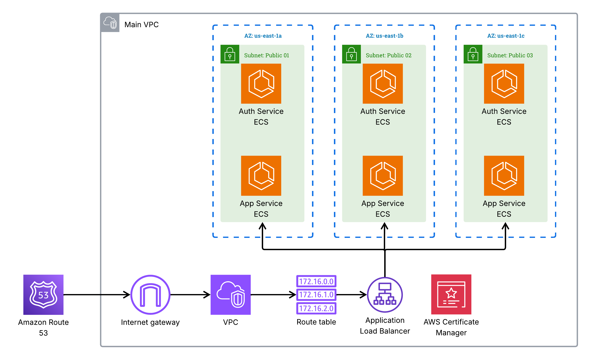

# README

## Terraform Infrastructure for "Let's Get Rusty - Bootcamp"

### Overview

This repository contains Terraform configurations to provision and manage cloud infrastructure for the "Let's Get Rusty - Bootcamp" project. The setup is designed to run in AWS and includes several components such as Virtual Private Clouds (VPCs), Subnets, Internet Gateways, ECS Clusters, Load Balancers, and Security Groups. It is architected to deploy two primary services: an Authentication Service (`auth-service`) and the Application Service (`app-service`) using AWS Fargate.

### Features

- **AWS VPC Configuration**: A primary VPC is created, including default and custom subnets.
- **Subnets**: Public subnets are provisioned across multiple availability zones for high availability.
- **Route Tables**: Configured to ensure proper routing between subnets and external traffic.
- **Internet Gateway**: Provides internet access to the VPC resources.
- **ECS Services**:
    - **Auth Service**: Manages user authentication with HTTPS load balancing and health checks.
    - **App Service**: Serves application functionality, interacting with the Auth Service via internal DNS.
- **Load Balancers**: Application Load Balancers (ALBs) handle HTTPS and HTTP traffic, redirecting HTTP to HTTPS for secure communication.
- **Security Groups**: Fine-grained access control for load balancers, ECS tasks, and other resources to ensure secure communication.
- **Task Definitions**: Defined for both app-service and auth-service to specify container configurations.
- **Environment Variables**: Supports flexibility in configuration using `.env` files.

### Usage

#### Prerequisites

- Terraform installed on your local machine.
- AWS SSO configured with appropriate IAM roles and permissions.

#### Steps to Deploy

Use the provided `Makefile` to simplify deployment.

1. Clone this repository:
    ```shell script
    git clone <repository-url>
    cd <repository-folder>
    ```

2. Create an `.env` file from `.env.example` and fill in the required variables:
    ```shell script
    cp .env.example .env
    ```

3. Fill out with your environment variables
    ```
    export TF_VAR_aws_sso_profile=
    export TF_VAR_key_name=
    export TF_VAR_main_dns=
    
    export AWS_TF_LGR_BUCKET_NAME=
    export AWS_TF_LGR_BUCKET_KEY=
    export AWS_TF_LGR_REGION=
    ```

4. Deploy the infrastructure using the `Makefile`:
    - **Login**:
    ```shell script
    make login
    ```
    
    - **Apply Terraform**:
    ```shell script
    make dev/apply
    ```
    
    - **Destroy the Infrastructure** (when teardown is needed):
    ```shell script
    make dev/destroy
    ```

### Environment Variables

Ensure the following variables are set in your environment before deployment:

- **TF_VAR_aws_sso_profile**: AWS SSO profile name.
- **TF_VAR_key_name**: Key pair name for EC2 instances (if applicable).
- **TF_VAR_main_dns**: Main domain or DNS entry for ALBs.

Additional AWS-specific variables:
- `AWS_TF_LGR_BUCKET_NAME`
- `AWS_TF_LGR_BUCKET_KEY`
- `AWS_TF_LGR_REGION`

### Architecture Diagram

This setup provisions the following resources:

1. **Infrastructure Layer**:
    - A VPC with public subnets across three availability zones.
    - Internet Gateway for public resource access.
    - Route tables for both public and default routing.

2. **Compute Layer**:
    - ECS clusters running app-service and auth-service tasks using the Fargate launch type.

3. **Networking and Security Layer**:
    - Load balancers for each service (auth and app).
    - Security groups for restricted communications:
        - Allow HTTPS (443) traffic to ALBs.
        - Allow redirecting from HTTP (80) to HTTPS.
        - Allow inter-service communications on their respective ports (3000 for `auth-service`, 8000 for `app-service`).

4. **Service Layer**:
    - Authentication Service with health checks and load-balancer-based redundancy.
    - Application Service with integration to `auth-service`.



### Key AWS Resources Used

- **Amazon ECS**: Serverless containerized services with Fargate.
- **AWS Application Load Balancer**: Routing and load balancing for HTTPS/HTTP traffic.
- **AWS VPC**: Isolated networking environment.
- **AWS Security Groups**: Fine-grained network access control.
- **AWS Certificates Manager (ACM)**: SSL/TLS certificates for HTTPS communication.

### License

This project is open-source and available under the [MIT License](LICENSE).
